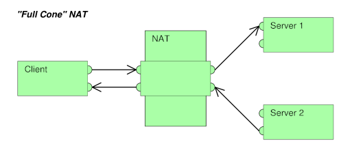

# Are VPNs Anonymous?
## Summary

A VPN (Virtual Private Network) extends a private network [^16] across a public network[^16] and enables users to send and receive data across shared or public networks as if their computing devices were directly connected to the private network. 

For security, the private network connection may be established using an encrypted layered [tunneling protocol](#tunneling-protocol), and users may be required to pass various authentication methods to gain access to the VPN [^1].  Nowadays, [OpenVPN](#openvpn) is the one of the best protocols available. There are other protocols, like PPTP, L2TP/IPSec, but we are not going to take them into account due to their security concerns.

Most VPN providers officially claim that they do not keep traffic logs, however it’s always important to check the company’s privacy policy and location of their headquarters (in terms of jurisdiction).

## Where can VPNs be installed?

VPNs are supported in many OS. Some of them are Windows, Mac OS X, iOS, Android, and Linux (Ubuntu) and Chrome book. They also work on mobile devices, like Android, IPhone and IPad.

Some routers also support VPNs. Find some of the firmware that support VPNs below.

| Firmware package | Cost | Developer                    |
| :--------------- | ---- | ---------------------------- |
| DD-WRT           | Free | NewMedia-NET GmbH            |
| Gargoyle         | Free | Eric Bishop                  |
| OpenWrt          | Free | Community driven development |
| OPNsense         | Free | Deciso BV                    |
| Tomato           | Free | Keith Moyer                  |

## Are they anonymous?  

While most VPN providers claim they do not keep logs, it is true that most companies keep basic connection logs(User [IP address](#ip-address) and VPN timestamp). It is very important to check the companies privacy policy and the location of their headquarters (in terms of jurisdiction).

It is also important to take into account the encryption standard used. Many VPN clients allow you to choose different standards. While the securer standards may slow down the internet connection, they will make sure your data is safer.

Typically, your ISP (Internet Service Provider) would have to pay special attention to your activity in order to determine whether you are using a VPN or not. However, if well protected, they won't be able to learn the nature of your activity. They are only able to see you are connected to a certain endpoint and the bandwidth you are using. If they want to learn more about you, they may request logs to your VPN provider (they probably need a court order to do that). See more information on this topics in the following subheadings.

### Personal information  

It is well known that companies keep personal information when we use their products. Now a days, it is very common (if not obligatory) that web pages ask you to accept their privacy policy and the use they give to your data (be by using cookies or any other means). When choosing a VPN service, it is very important to read carefully the privacy policy of that company in order to be aware of the data they store about us. It would make no sense that we used a VPN to hide our personal data ( [IP](#ip-address), billing information, name, ...) but the VPN itself stores and uses that information!

### Different levels of logging  
Companies may have different logging levels. These are the three main categories:

1. **Usage (browsing) logs** – These logs basically include online activity: browsing history, connection times, [IP addresses](#ip-address), metadata, etc. From a privacy standpoint, you should avoid any VPN that collects usage data. Most of the VPN services that are collecting usage logs are free VPN apps, which are basically spyware. The data they collect is then sold to third parties, thereby monitoring the “free VPN” service.

2. **Connection logs** – Connection logs typically include dates, times, connection data, and sometimes [IP addresses](#ip-address). Typically this data is used for optimizing the VPN network and potentially dealing with user problems or terms of use issues (torrenting, illegal activities, etc.).

3. **No logs** – No logs simply means the VPN service is not keeping any logs whatsoever. Having a truly no logs policy can be difficult to implement while at the same time enforcing restrictions, such as device connections or bandwidth. This is especially the case when VPNs need to enforce restrictions such as bandwidth or the number of devices being used per subscription.

While basic connection logs are not necessarily a problem, there is an increasing number of VPNs that keep connection logs, while falsely claiming to be a “no logs” service. Examples of this are Betternet, PureVPN, Windscribe, and TunnelBear. That is why it is very important to be aware of our VPN provider's privacy policy and the jurisdiction of their headquarters [^7].

### Data encryption  

Essentially, data encryption provides users with a secure VPN tunnel whereby data is protected. However, there are different levels of encryption as well. By default [OpenVPN](#openvpn) includes AES-128 [^8], SHA-1 [^9], and RSA-2048 [^10], while maximum encryption includes AES-256 [^8], SHA-256 [^11], and RSA-4096 [^10]. An [encryption key](#encryption-key) tells your computer how to decrypt or encrypt data.

Data authentication is part of the encryption process and refers to the message authentication algorithm with which user data is authenticated. This is used to protect users from active [security attacks](#security-attacks).  

### Further considerations

VPN servers may use static or dynamic [IP addresses](#ip-address). The later are the most common used. There are pros and cons for both approaches, and they can be important to the user depending on the use given to the VPN (and the budget available). 

- **Dynamic [IP address](#ip-address)**
  - Pros - They provide greater anonymity for public WiFi hotspots, for they implement [NAT](#nat) and offer a wider range of [IPs](#ip-address).
  - Cons - [IPs](#ip-address) can be abused by other users of the network[^16], be it by spamming or hacking. This can lead to being banned from certain websites, or being suspicious of illegal activity.
- **Static [IP address](#ip-address)**
  - Pros - Unique [IP](#ip-address) for user. Harder to block by ISP or Network Administrators, since they use their own ports.
  - Cons - Expensive.

Some VPN servers offer built-in [DNS](#dns) protection. This happens because there is a well-know flaw in some operative systems that, despite having routed the traffic through a VPN server, keep contacting websites using their original [IP](#ip-address) and [DNS](#dns). This is a treat to your online security, anonymity and usefulness of your VPN. Altough these [DNS](#dns) leaks can be prevented, it can be worth looking for a VPN with built-in protection.

Notice that using a VPN does not protect you from malicious software. While some VPN providers offer additional protection, most do not. Viruses, spyware and malware can still harm you when you are using a VPN.

Many VPN offer anonymous payment options, like Bitcoin, Altcoins, Alipay, CashU, PaySafeCard, Gift Cards and others. These can be an extra anonymity layer to take into account.

Deep packet inspection (DPI) [^21] or packet sniffing is a type of data processing that inspects in detail the data being sent over a computer network [^16], and usually takes action by blocking, re-routing, or logging it accordingly.  It is used by ISPs, government agencies, and hackers to monitor and retain all of the data transmitted to and from your computer, including confidential and private information. To help customers bypass this, VPN providers are actively implementing modified OpenVPN protocols with added obfuscation layers, which masks VPN traffic away from view of DPI crawls. Check your VPN provider on this topic.

## Free or Paid VPNs?  
Free VPN services normally offer slower bandwidth and a smaller server range. It is also important to consider that everyone wants to make a living, so while they claim to be free, they may make money using other means, which, in some cases, compromise the users confidentiality ( see the case of [Hola](#Hola-VPN) in the appendix ).  

A legitimate and reliable paid VPN service offers several advantages, including a much more private environment, authentic guarantees, faster speeds, more servers, more extra features and add-on services, as well as being less likely to log traffic or connection logs. Normally, and given that you pay for them, they are more likely to be safe compared to free services.

# Appendix

#### Communication protocol

A communication protocol is a system of rules that allow two or more entities of a communications system to transmit information via any kind of variation of a physical quantity. The protocol defines the rules, syntax, semantics and synchronization of communication and possible error recovery methods. Protocols may be implemented by hardware, software, or a combination of both [^3].

#### Tunneling protocol

A tunneling protocol is a [communication protocol](#communication-protocol) that allows for the movement of data from one network [^16] to another. Because tunneling involves [repackaging](#encapsulation) the traffic data into a different form, perhaps with [encryption](#encryption) as standard, it can hide the nature of the traffic that is run through a tunnel [^2].  

#### Encapsulation

In computer networking [^16], encapsulation is a method of designing modular communication protocols in which logically separate functions in the network are abstracted from their underlying structures by inclusion or information hiding within higher level objects [^4].  

#### Encryption

In cryptography, encryption is the process of encoding information. This process converts the original representation of the information, known as plaintext, into an alternative form known as ciphertext. Only authorized parties can decipher a ciphertext back to plaintext and access the original information [^4].  

#### OpenVPN

OpenVPN is open-source software (there is a commercial version and a free edition) that implements virtual private network (VPN) techniques to create secure point-to-point or site-to-site connections in routed or bridged configurations and remote access facilities. It uses a custom security protocol that utilizes SSL/TLS for key exchange. It is capable of traversing network address translators (NATs) and firewalls.

OpenVPN allows peers to authenticate each other using pre-shared secret keys, certificates or username/password (this part requires third party modules). When used in a multi client-server configuration, it allows the server to release an authentication certificate for every client, using signatures and certificate authority. It uses the OpenSSL encryption library extensively, as well as the TLS protocol, and contains many security and control features.

OpenVPN uses the OpenSSL library to provide encryption of both the data and control channels. It lets OpenSSL do all the encryption and authentication work, allowing OpenVPN to use all the ciphers available in the OpenSSL package. It can also use HMAC packet authentication feature to add an additional layer of security. Mbed TLS is available starting from version 2.3 [^6].  

#### Security Attacks  

Security attacks [^12] can be divided in two groups: active and passive attacks:

- **Active attacks** - An Active attack attempts to alter system resources or effect their operations. Active attack involve some modification of the data stream or creation of false statement 

- **Passive attacks** - A Passive attack attempts to learn or make use of information from the system but does not affect system resources. Passive Attacks are in the nature of eavesdropping on or monitoring of transmission. The goal of the opponent is to obtain information is being transmitted.

#### Encryption Key

Encryption keys are used to encrypt data. The most common forms of encryption are symmetric-key encryption and public-key encryption [^14].

- **Symmetric-key encryption** - All users share the same key, enabling everyone with the key to encrypt and decrypt data.
- **Public-key encryption** - Each user has a public-private key pair. One user has a private key to encrypt data while another user has the corresponding public key to decrypt that data.

#### IP Address  

An Internet Protocol Address[^15] is a numerical label assigned to each device connected to a computer network[^16] that uses the Internet Protocol[^17] for communication. They server two main functions: identification of a host or network interface and location addressing (transferring information from one place to another) .

#### Hola VPN   

Hola, based out of Israel, is mainly a free VPN service. It also offers paid subscriptions. Hola was the first [P2P](#p2p) based VPN service created. But this VPN services did not become famous for its good things, but for its bad things. According to their privacy policy, we can say the following:

- **Location of their headquarters** - They are located in Israel, outside the 14-Eyes Countries and Jurisdiction [^18]. However, Israel is cooperative with this alliance, where they share all their espionage information.

- **Logging level** - They log the following data: browser type, web pages visited, time spent on this pages, access times and dates. We could say they know nearly everything about your internet activity. They store **usage logs**.
- **Personal data** - They store your [IP address](#ip-address), name, email and they may share it “subsidiaries and affiliated companies".
- **Encryption level** -  Non-existent. Hola VPN uses a proxy tunnel, transmitting information in plain text.

##### Conclusion: Is Hola VPN Safe?

No, specially for free users. Take into consideration that, when using this VPN, other users can use your computer bandwidth for illegal purposes! Furthermore, they are aware that malicious users may bypass their security checkups and gain access to your computer and they are warning you about that in their security policies, saying they will try their best to fix this issues.

#### P2P  
Peer-to-peer (P2P) computing or networking is a distributed application architecture that partitions tasks or workloads between peers. Peers are equally privileged, equally potent participants in the application. They are said to form a peer-to-peer network of nodes. P2P was popularized by the music-sharing application Napster, and it is the root of file-sharing and torrenting.

Peers make a portion of their resources, such as processing power, disk storage or network bandwidth, directly available to other network participants, without the need for central coordination by servers or stable hosts. Peers are both suppliers and consumers of resources, in contrast to the traditional [client-server](https://en.wikipedia.org/wiki/Client-server) model in which the consumption and supply of resources is divided [^13].

#### NAT  

Network address translation (NAT) [^19] is a method of remapping an [IP address](#ip-address) space (a range of discrete IP addresses) into another by modifying the identifier of the network interface or host in the packet in transit across a routing device. IP masquerading, similar to NAT, consists on hiding an entire address space behind a single [IP address](#ip-address). This is used in common routers, so that all the devices connected to the network share one public [IP address](#ip-address).

#### DNS

The Domain Name System (DNS) [^20] is a naming system for devices connected to a network. Mainly, it translates [IP addresses](#ip-addres) needed for locating and identifying computers to domain names. 

# References

| **Reference**                                                | **Date**   | **Content**                         |
| ------------------------------------------------------------ | ---------- | ----------------------------------- |
| https://en.wikipedia.org/wiki/Virtual_private_network        | 10/08/2020 | Wikipedia - Virtual Private Network |
| https://en.wikipedia.org/wiki/Tunneling_protocol             | 10/08/2020 | Wikipedia - Tunneling protocol      |
| https://en.wikipedia.org/wiki/Encapsulation_(networking)     | 10/08/2020 | Wikipedia - Encapsulation           |
| https://en.wikipedia.org/wiki/Communications_protocol        | 10/08/2020 | Wikipedia - Communications Protocol |
| https://en.wikipedia.org/wiki/Encryption                     | 10/08/2020 | Wikipedia - Encryption              |
| https://en.wikipedia.org/wiki/OpenVPN                        | 11/08/2020 | Wikipedia - OpenVPN                 |
| https://www.bestvpnz.com/vpn-101-everything-you-need-to-know-about-virtual-private-networks | 11/08/2020 | About VPNs                          |
| https://pixelprivacy.com/vpn/no-log-vpn                      | 11/08/2020 | Logless VPNs                        |
| https://en.wikipedia.org/wiki/Advanced_Encryption_Standard   | 13/08/2020 | AES Encryption Standard             |
| https://en.wikipedia.org/wiki/SHA-1                          | 13/08/2020 | SHA-1 Encryption Standard           |
| https://en.wikipedia.org/wiki/SHA-2                          | 13/08/2020 | SHA-2 Encryption Standard           |
| https://en.wikipedia.org/wiki/RSA_(cryptosystem)             | 13/08/2020 | RSA Encryption Standard             |
| https://www.geeksforgeeks.org/active-and-passive-attacks-in-information-security | 13/08/2020 | Active and Passive Security Attacks |
| https://support.microsoft.com/en-us/help/246071/description-of-symmetric-and-asymmetric-encryption | 13/08/2020 | Encryption Keys                     |
| https://proprivacy.com/vpn/review/hola                       | 21/08/2020 | Hola VPN Review                     |
| https://thebestvpn.com/reviews/hola-vpn/                     | 21/08/2020 | Hola VPN Review                     |
| https://en.wikipedia.org/wiki/Client-server                  | 21/08/2020 | Wikipedia - Client-Server model     |
| https://en.wikipedia.org/wiki/Peer-to-peer                   | 21/08/2020 | Wikipedia -  Peer To Peer           |
| https://en.wikipedia.org/wiki/IP_address                     | 22/08/2020 | Wikipedia - IP Address              |
| https://thebestvpn.com/5-9-14-eyes-countries/                | 24/08/2020 | 14-Eyes Countries and Jurisdiction  |
| https://privacyaustralia.net/hola-vpn-review/                | 24/08/2020 | Hola VPN Review                     |
| https://en.wikipedia.org/wiki/Network_address_translation    | 24/08/2020 | Wikipedia - NAT                     |
| https://en.wikipedia.org/wiki/Domain_Name_System             | 24/08/2020 | Wikipedia - DNS                     |
| https://en.wikipedia.org/wiki/Deep_packet_inspection         | 24/08/2020 | Wikipedia - DPI                     |

[^1]: https://en.wikipedia.org/wiki/Virtual_private_network  "Wikipedia - Virtual Private Network"  
[^2]: https://en.wikipedia.org/wiki/Tunneling_protocol  "Wikipedia - Tunneling protocol"  
[^3]: https://en.wikipedia.org/wiki/Communications_protocol "Wikipedia - Communications Protocol"  
[^4]: https://en.wikipedia.org/wiki/Encapsulation_(networking) "Wikipedia - Encapsulation"  
[^5]: https://en.wikipedia.org/wiki/Encryption "Wikipedia - Encryption"  
[^6]: https://en.wikipedia.org/wiki/OpenVPN "Wikipedia - OpenVPN"  
[^7]: https://pixelprivacy.com/vpn/no-log-vpn/ "Logless VPNs"  
[^8]: https://en.wikipedia.org/wiki/Advanced_Encryption_Standard "AES Encryption Standard"  
[^9]: https://en.wikipedia.org/wiki/SHA-1 "SHA-1 Encryption Standard"  
[^11]: https://en.wikipedia.org/wiki/SHA-2 "SHA-2 Encryption Standard"  
[^10]: https://en.wikipedia.org/wiki/RSA_(cryptosystem) "RSA Encryption Standard"  
[^12]: https://www.geeksforgeeks.org/active-and-passive-attacks-in-information-security/ "Active and Passive Security Attacks"  
[^13]: https://en.wikipedia.org/wiki/Peer-to-peer "Wikipedia - Peer to Peer"  
[^14]: https://support.microsoft.com/en-us/help/246071/description-of-symmetric-and-asymmetric-encryption "Encryption Keys"  
[^15]: https://en.wikipedia.org/wiki/IP_address "Wikipedia - IP Address" 
[^16]: https://en.wikipedia.org/wiki/Computer_network "Wikipedia - Computer Network"  
[^17]: https://en.wikipedia.org/wiki/Internet_Protocol "Wikipedia - Internet Protocol"
[^18]: https://thebestvpn.com/5-9-14-eyes-countries/ "14-Eyes Countries and Jurisdiction"
[^19]: https://en.wikipedia.org/wiki/Network_address_translation "Wikipedia - NAT"  
[^20]: https://en.wikipedia.org/wiki/Domain_Name_System "Wikipedia - DNS"
[^21]: https://en.wikipedia.org/wiki/Deep_packet_inspection "Wikipedia - DPI"  
